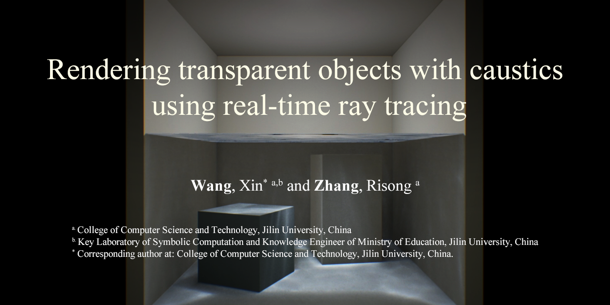
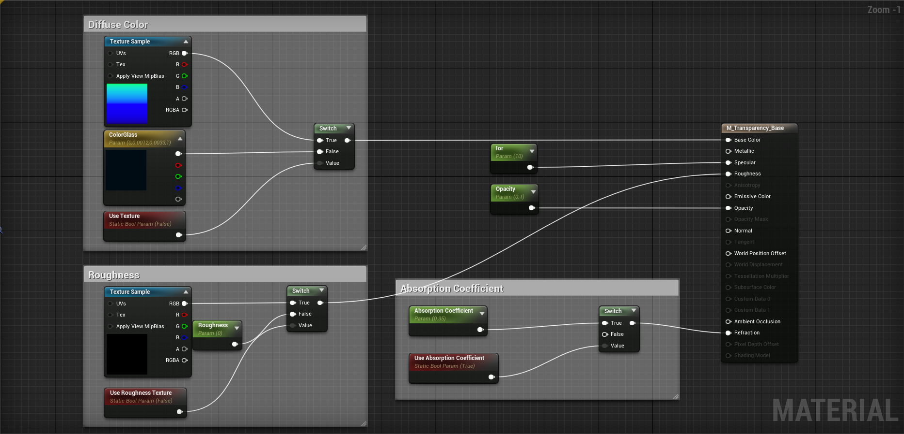

RTRT-Trans&Caustics
===

[Chinese Version](./ReadmeCHS.md)


This is a reference implementation of `Rendering transparent objects with caustics using real-time ray tracing`<sup>[1]</sup> using Unreal Engine 4.25.1.
It approximates several transparency features, including reflections/refractions, volumetric absorption, rough transparency, and refractive caustics.
The results are relatively noise free and a step up over the prior raster hacks in that the model plays together into a cohesive whole, rather than being individual effects.
Should you be making use of our work, please cite our paper<sup>[1]</sup>.

[Paper](https://www.sciencedirect.com/science/article/pii/S009784932100039X "The paper is now available online.") 

Setup
---

The current implementation is based on UE4.25.1.
To use this implementation, please download the source code of Unreal Engine 4.25.1 from <https://github.com/EpicGames/UnrealEngine> in advance.

After successfully completing the step above, drag all the files in [Code](./Code) into the root directory of the downloaded source code.
You may be prompted to overwrite existing files when draging in the files.
Please select `Yes` for all files.

To get up and run the Unreal Engine, please refer to the [tutorial from EpicGames](https://github.com/EpicGames/UnrealEngine/blob/release/README.md).

We list our hardware and software as follow:

| Hardware/Software | Version |
| :----: | :----:|
| CPU | Intel® Core™ i9-10900K |
| Graphical Card | Nvidia® RTX™ 2080 Ti |
| RAM | 64GB |
| Visual Studio | 2019 16.7.2 |
| Windows 10 SDK | 10.0.18362.0 |
| Build Tools | MSVC v142 |
| Unreal Engine | 4.25.1 |

Usage
---

### Enable our work in UE4

Drag a `Post Process Volume` actor to the scene and switch the property `Ray Tracing Translucency` to `Ray Tracing`.
For more details, please check this [toturial](https://docs.unrealengine.com/en-US/RenderingAndGraphics/RayTracing/RayTracingSettings/index.html) from the Unreal Engine Documatation.


### Material Parameters

The blending mode each transparent material must be `Translucent` and the shading model must be `Default Lit`.
Furthermore, to enable the roughness, the lighting model must be `Surface Forward Shading`.


We introduce three material parameters into our work, which are the `absorption coefficient`, `roughness` and the `opacity`.
Additionally, the parameter `Specular` controls the Ior of the material.
How these parameters affect the results can be found in the supplementary material to the paper.



P.S. We provide a [demo project](./Demo/DemoProject) with several sample scenes which have been configured.

Video Results
---

[](https://www.bilibili.com/video/BV1Xy4y147tq "Video Result from Bilibili")

License
---

The provided implementation is strictly for academic purposes only.
Should you be interested in using our technology for any commercial use, please feel free to contact us.

TODO
---
* Move to a new shading mode and update the parameters of the root node of the material.
* Extend LLT to handle stacked transparent objects, like Barré-Brisebois et al.'s work<sup>[2]</sup>.
* Design a denoiser that can supress the noise in rough transparncy, reflections, and refractive caustics.
* Chage the order of the passes in LHPC and make the caustics can be seen through the transparent object, similar to Ouyang and Yang's work<sup>[3]</sup>.

Acknowledgment
---

This work was supported by the National Natural Science Foundation of China [51627805].
The authors would like to thank the anonymous reviewers for both their helpful comments and suggestions.
The authors also would like to thank Hyuk Kim for his help in implementing the SSPM<sup>[4]</sup>$.
The authors wish to thank the starter content of UE4 for the materials and the project _ArchViz_ Interior for the model of the apple and polyhedron.
Other scene elements were purchased from <https://aigei.com>.

References
---

```
[1] @article{XWRZ2021,
    title = {Rendering transparent objects with caustics using real-time ray tracing},
    journal = {Computers & Graphics},
    volume = {96},
    pages = {36-47},
    year = {2021},
    doi = {10.1016/j.cag.2021.03.003},
    author = {Wang, Xin and Zhang, Risong}
    }
```

```
[2] @inbook{Barr2019,
	author={Barr{\'e}-Brisebois, Colin
	and Hal{\'e}n, Henrik
	and Wihlidal, Graham
	and Lauritzen, Andrew
	and Bekkers, Jasper
	and Stachowiak, Tomasz
	and Andersson, Johan},
	title={Hybrid Rendering for Real-Time Ray Tracing},
	bookTitle={RayTracing Gems: High-Quality and Real-Time Rendering with DXR and Other APIs},
	year={2019},
	pages={437-473}
    }
```

```
[3] @Misc{RTXGI2020,
	author = {Ouyang, Yaobin and Yang, Xueqing},
	title = {Generating Ray-Traced Caustic Effects in Unreal Engine 4, Part 1},
	date = {2020-12-08},
	url ={https://developer.nvidia.com/blog/generating-ray-traced-caustic-effects-in-unreal-engine-4-part-1/},
    }
```

```
[4] @inbook{Kim2019,
	author = {Kim, Hyuk},
	title = {Caustics Using Screen-Space Photon Mapping},
	bookTitle={Ray Tracing Gems: High-Quality and Real-Time Rendering with DXR and Other APIs},
	year={2019},
	pages = {543-555}
    }
```
